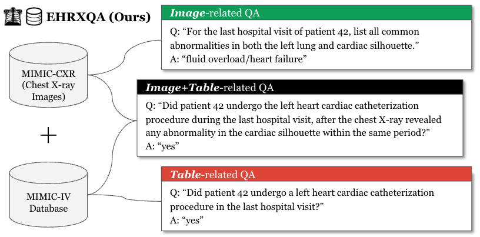

# ML4H-2024 Project 2: Multi-modal Question Answering on Electronic Health Records with Chest X-ray Images

<p align="center">
    
</p>

<p align="center">
  <a href="#overview">01 Overview</a> |
  <a href="#timeline">02 Timeline</a> |
  <a href="#dataset">03 Dataset</a> |
  <a href="#evaluation">04 Evaluation</a> |
  <a href="#baseline">05 Baseline</a> |
  <a href="#submission">06 Submission</a> |
  <a href="#contact">07 Contact</a>
</p>

## <a name="overview"></a>01 Overview

<p align="center">
    
</p>

Electronic Health Records (EHRs) contain a wealth of patient information across multiple modalities, including structured records, images, and clinical text. However, current EHR question answering (QA) systems focus on a single modality, overlooking the multi-modal nature of EHRs. To fully utilize EHR data and support clinical decision-making, it is crucial to develop versatile QA systems that can navigate across multiple modalities. Building upon the text-to-SQL system developed in Project 1, which focused on structured EHR data, Project 2 aims to create a multi-modal QA system that incorporates both structured records (MIMIC-IV) and chest X-ray images (MIMIC-CXR-JPG). This system will answer questions spanning three modalities: _Image_-related, _Table_-related, and _Image+Table_-related.


## <a name="timeline"></a>02 Timeline

All deadlines are 11:59PM UTC-12:00 (Anywhere on Earth), unless stated otherwise
- Dev phase starts: April 25, 2024 (00:00AM UTC)
- Test phase starts: June 03, 2024 (00:00AM UTC)
- Test submission due: June 07, 2024 (11:59PM UTC)
- Final result release: June 08, 2024 (KST)
- Presentation: June 11, 2024 (KST)


## <a name="dataset"></a>03 Dataset


### Statistics of EHRXQA Dataset

| #Train | #Valid | #Test |
|:-------:|:-------:|:-------:|
| <40K | <6K | <5K |


### Access Requirements

The EHRXQA dataset is constructed from the MIMIC-CXR-JPG (v2.0.0), Chest ImaGenome (v1.0.0), and MIMIC-IV (v2.2). All these source datasets require a credentialed Physionet license. Due to these requirements and in adherence to the Data Use Agreement (DUA), only credentialed users can access the EHRXQA dataset files. To access the source datasets, you must fulfill all the following requirements:


1. Be a [credentialed user](https://physionet.org/settings/credentialing/)
    - If you do not have a PhysioNet account, register for one [here](https://physionet.org/register/).
    - Follow these [instructions](https://physionet.org/credential-application/) for credentialing on PhysioNet.
    - Complete the "CITI Data or Specimens Only Research" [training course](https://physionet.org/about/citi-course/).
2. Sign the data use agreement (DUA) for each project
    - https://physionet.org/sign-dua/mimic-cxr-jpg/2.0.0/
    - https://physionet.org/sign-dua/chest-imagenome/1.0.0/
    - https://physionet.org/sign-dua/mimiciv/2.2/


### Accessing the EHRXQA Dataset

Ensure you have Python 3.8.5 or higher installed on your machine. Set up the environment and install the required packages using the commands below:

```
# Set up the environment
conda create --name ehrxqa python=3.8.5

# Activate the environment
conda activate ehrxqa

# Install required packages
pip install pandas==1.1.3 tqdm==4.65.0 scikit-learn==0.23.2 
pip install dask=='2022.12.1'
```

To access the EHRXQA dataset, run the provided main script (which requires your unique Physionet credentials) in this repository as follows:

```bash
# During the dev phase (2024-04-25), run the script with the "dev" phase argument
python build_ehrxqa_benchmark.py --phase "dev"

# During the test phase (2024-06-03), run the script with the "test" phase argument
python build_ehrxqa_benchmark.py --phase "test"
```

During script execution, enter your PhysioNet credentials when prompted:
- **Username:** Enter your PhysioNet username and press `Enter`.
- **Password:** Enter your PhysioNet password and press `Enter`. Note: The password characters won't appear on the screen.

This script performs several actions: 1) it downloads the source datasets from Physionet, 2) preprocesses these datasets, and 3) generates the complete EHRXQA dataset by creating ground-truth answer information.

Ensure you keep your credentials secure. If you encounter any issues, please check that you have the necessary permissions, a stable internet connection, and all prerequisite tools installed.


### Data Format

For this task, we provide separate JSON files for the train, validation, and test sets. After running the provided script (`build_ehrxqa_benchmark.py`), you will find the data files in the `dataset` directory. For each split, the data is stored as two separate files: one for the data (Question, NeuralSQL) and one for the answers. The data files are named `train_data.json`, `valid_data.json`, and `test_data.json`, while the answer files are named `train_answer.json`, `valid_answer.json`, and `test_answer.json`, respectively.

Here is an example of the data format for the `train_data.json` file:

```json
[
  {
    "id": 0,
    "db_id": "mimic_iv_cxr",
    "split": "train",
    "question": "How many days have passed since the last chest x-ray of patient 18679317 depicting any anatomical findings in 2105?",
    "query": "SELECT 1 * (strftime('%j', current_time) - strftime('%j', t1.studydatetime)) FROM (SELECT tb_cxr.study_id, tb_cxr.studydatetime FROM tb_cxr WHERE tb_cxr.study_id IN (SELECT DISTINCT tb_cxr.study_id FROM tb_cxr WHERE tb_cxr.subject_id = 18679317 AND strftime('%y', tb_cxr.studydatetime) = '2105')) AS t1 WHERE func_vqa(\"is the chest x-ray depicting any anatomical findings?\", t1.study_id) = true"
  },
  {
    ...
  }
]
```

Also, here is an example of the data format for the `train_answer.json` file:

```json
[
  {
    "id": 0,
    "answer": [0]
  },
  {
    ...
  }
]
```

Each dictionary in the list contains the following fields:

- **id**: The unique identifier for each question of each split.
- **db_id**: The database identifier for the question.
- **split**: The split of the data (train, valid, or test).
- **question**: The question to be answered.
- **query**: The SQL query that can be used to answer the question.

The answer file contains the following fields:

- **id**: The unique identifier for each question of each split.
- **answer**: The answer to the question. The answer is a list of integers, where each integer corresponds to the index of the answer in the SQL query result.


## <a name="evaluation"></a>04 Evaluation

We will use the reliability score (similar to project 1) as the evaluation metric. The official evaluation metric for this task is the reliability score, which is a measure of the reliability of the model's predictions. The reliability score is calculated based on the model's predictions and the ground-truth answers. Here is the reliability score formula:

```math
\phi_c (x) = 
\begin{cases} 
1 & \text{if } x \in \mathcal{Q}_{\text{ans}}, g(x) = 1; \text{Acc}(x) = 1 \\
0 & \text{if } x \in \mathcal{Q}_{\text{ans}}, g(x) = 0, \\
-c & \text{if } x \in \mathcal{Q}_{\text{ans}}, g(x) = 1; \text{Acc}(x) = 0 \\
-c & \text{if } x \in \mathcal{Q}_{\text{una}}, g(x) = 1, \\
1 & \text{if } x \in \mathcal{Q}_{\text{una}}, g(x) = 0.
\end{cases}
```

**However, unlike project 1, in this task, we do not include unanswerable questions.** Therefore, the reliability score will be calculated based on the answerable questions only. So, here is how the reliability score works within our EHRXQA dataset scope:

```math
\phi_c (x) = 
\begin{cases} 
1 & \text{if } x \in \mathcal{Q}_{\text{ans}}, g(x) = 1; \text{Acc}(x) = 1 \\
0 & \text{if } x \in \mathcal{Q}_{\text{ans}}, g(x) = 0, \\
-c & \text{if } x \in \mathcal{Q}_{\text{ans}}, g(x) = 1; \text{Acc}(x) = 0.
\end{cases}
```

**Furthermore, since the EHRXQA dataset contains three types of questions: Image-, Table-, and Image+Table-related QA, we will calculate the reliability score for each type of question and report all reliability scores in the leaderboard.**


## <a name="baseline"></a>05 Baseline

We provide a "null"-baseline example as follows:

```python
from post_processing import post_process_answer

def predict(data):
    predictions = []
    for entry in data:
        predictions.append({"id": entry["id"], "answer": "null"})
        # after post-processing, the answer will be converted to the correct format (but for "null" it will remain "null")
        # predictions.append({"id": entry["id"], "answer": post_process_answer("null")}
    return predictions
```


## <a name="submission"></a>06 Submission

#### File Format

After saving your prediction file, compress (zip) it using a bash command, for example:
```
zip predictions.zip prediction.json
```

#### Submitting the File

Submit your prediction file on our task website on Codabench.


## <a name="contact"></a>07 Contact

For any questions related to the task, please contact the organizers via the course Classum or github issues.